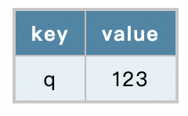

## intention

sometimes the url are too long to read, and if we want to check some query in url will be difficult

so I use `URLSearchParams` to display the query in table list

## Use

`git clone git@github.com:HomyeeKing/homybe.git`

then laod it from chrome

## preview

when the url is `https://github.com/?q=123`，the popup will be

 


## quick get qrcode when hover the image


[qrcode](https://github.com/HomyeeKing/homybe/assets/49113249/f6c38cfd-51e4-4093-ae61-25085ff919c6)


## explain manifest.json structure

```json
{
  "minifest_version": 3,
  "permission": ["tabs"], // the list that enable chrome features
  "optional_permissions": ["unlimitedStorage"], //
  "host_permissions": ["http://www.blogger.com/", "*://*/*"], // specify which domain can run the extension
  "content_security_policy": {  // manage CSP
    "extension_pages": "...", // in the form of chrome-extension://<extension-id>/foo.html
    "sandbox": "..."
  },

  "action":{
      
  }

}
```
